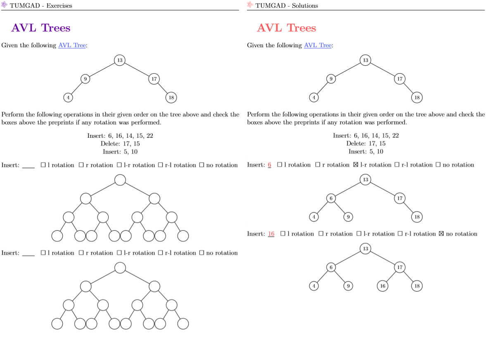
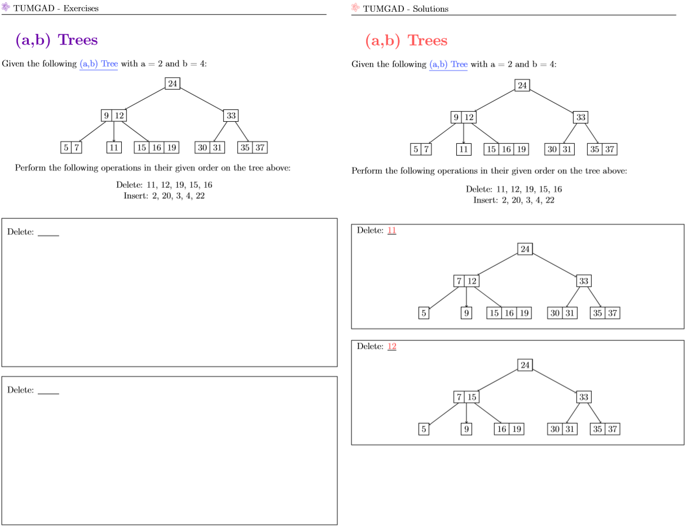

# TUMGAD
<!-- favicon by Becris from flaticon.com -->
Exercise generation and helpful materials for the course Introduction to Algorithms and Data Structures.
Developed by students from the Technical University of Munich primarily for fellow students.

Some of the Exercises TUMGAD can generate:
- AVL-Trees
- (a,b)-Trees
- Binomial Heaps
- Dijkstra's Algorithm
- ...

You can check the generator status (which exercises is TUMGAD capable of generating) [here](https://github.com/users/SebastianOner/projects/1)
## About
TUMGAD is a tool for anyone wanting to learn about some the most famous Algorithms and Data Structures, though it 
was mainly developed for Students of the Technical University of Munich.

Furthermore, it was created using Lecture Resources of the TUM provided in the summer
semester of 2019 as well as the Book [Algorithms and Data Structures: The Basic Toolbox](https://www.springer.com/gp/book/9783540779773).
Hence there may be different definitions in this project than you are used to.

Please be aware that this is still very much a work in progress.

### How it works
In the source code of TUMGAD all the data structures and algorithms are already
implemented, as well as a method that takes the products of these components 
and visualizes them using LaTeX, whereby the placeholders in the LaTeX templates 
will be replaced with the generated structures.

Easy example: The implementation for QuickSort generates a random array and converts it
to a string (simple enough) and then that string replaces the placeholder "$INITARRAY$" in the 
exercise template. Later, the LaTeX will be compiled and the output written to two PDFs, one
with the exercise, the other with the solutions. 

For a complete example, you can look at [these PDFs](docs)

## How to Use
For a **detailed setup and usage guide**, have a look [at this](Setup.md).

You can generate exercises and their solutions by executing the main method in the src/Tumgad.java file.
For this, the only prerequisite is a working version of [pdflatex](https://www.latex-project.org/get/) added 
to your [PATH](https://tex.stackexchange.com/questions/60702/setting-up-miktex-and-texworks) (However you can work around this by manually compiling docs/Exercises.tex and docs/Solutions.tex).

Please note: For now, the exercise generator is optimized for IDE, if you want to use it in your command line, you will likely
have to make some small adjustments.

Visit [ossner.github.io/TUMGAD/](https://ossner.github.io/TUMGAD/src/routes)
## Contributing
If you spot an issue you can report it [here](https://github.com/ossner/TUMGAD/issues/new?assignees=&labels=&template=bug_report.md&title=)

If you have an idea for a feature you can submit it [here](https://github.com/ossner/TUMGAD/issues/new?assignees=&labels=&template=feature_request.md&title=)

Or just submit a pull request if you're familiar with GitHub. Contributing guidelines can be found [here](CONTRIBUTING.md)
