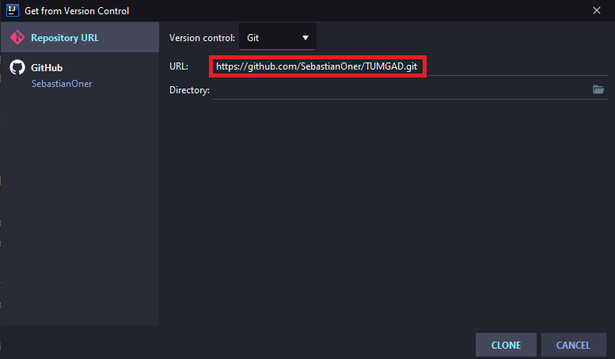
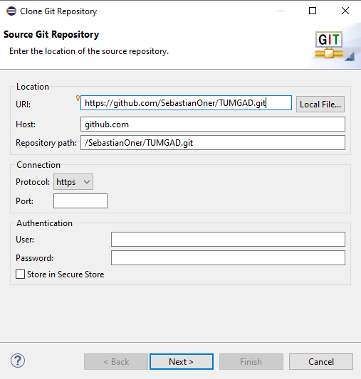

# Setup the TUMGAD generator
## Prerequisites
1. LaTex: LaTeX is a well-known and widely used text presentation system.
In essence LaTex compiles text written in a LaTeX (.tex) file and
produces a pdf with tables, images, graphs, etc.

    You can [get LaTeX here](https://www.latex-project.org/get/#tex-distributions).

2. Java Development Kit (JDK) >= 11. The JDK is used to run the actual
Java code. Depending on your preferences, you can execute the jar or run
the program in an IDE

    Get the JDK 13 [here](https://www.oracle.com/java/technologies/javase-jdk13-downloads.html).

## Adding to PATH
You have to add both **pdflatex** and **java** to your PATH environment variable

1. pdflatex: On Windows and Linux the PATH should be set automatically,
for macOS, you can look at the official instructions [here](https://miktex.org/howto/modify-path)

    You can check if you have LaTeX added by opening a new Terminal and simply typing
`pdflatex`. If you don't get an error, it is set up correctly

2. Java: Adding java to PATH is only necessary if you intend to use the
jar file provided in the repository, if that's the case I trust you know 
how to set environment variables. 

## Installation
Due to a lack of functionality from eclipse, I strongly recommend you use
IntelliJ IDEA. In Eclipse, you may need to install
[this plugin](http://mihai-nita.net/2013/06/03/eclipse-plugin-ansi-in-console/)
to show the colors in the console output.

1. IDE (IntelliJ): New Project -> Project from version control ->

    

    After this, you can simply click through the steps as usual.

2. IDE (Eclipse): Clone a git repository -> 

    
    
    After this, simply click through and add the project as usual

This only covered creating a project from version control, there
are many other ways to create a project, I'm sure you'll find one that works 
for you.

## Using the generator
You can find the only main method in src/Tumgad.java, after you execute it, you have the option to enter a seed. The same seed will produce the
same exercises **every time** this makes it easier if you want to repeat
more difficult exercises or share them.

After the seed, you can select which exercises should be generated enter 
your selections separated by a space (ex: `TRAV AB AVL`) or simply type X
to generate everything.

Please note that the first execution might take
exceptionally long, since LaTeX has to download a multitude of packages.
