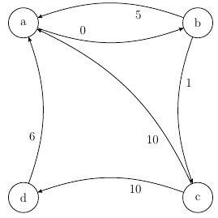
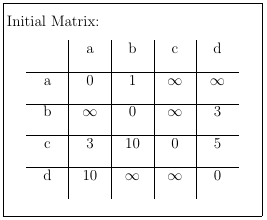
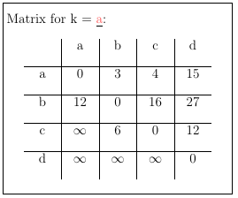
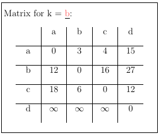
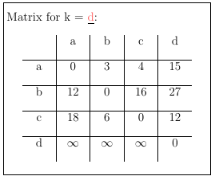

# Floyd-Warshall Algorithm (All Pairs Shortest Paths)

The Floyd-Warshall algorithm is one of the most simple algorithms
that solves the problem of finding the shortest path between all
pairs of nodes in a graph.

Trivially, in a graph with e.g. 5 nodes there are 20 distances
to be considered (not counting the ones from a node to itself)

It is easiest to align this information in a table to keep track
of the distances. Unknown/Unreachable distances are by definition
filled with infinity.

Consider the following example graph:

After initialization the table looks like this:

Now, step by step we look at the next node lexicographically (a first)
and iterate through the column of a line by line. The node
at the current step will be labelled x.

We will have to start another iteration over the line of a, call
that y.

If the cell at [x][a] + [a][y] is smaller than [x][y], we update
[x][y] to the value calculated.

Repeat these steps for b, c and d to get the final matrix, with the
shortest paths from one node to another.

