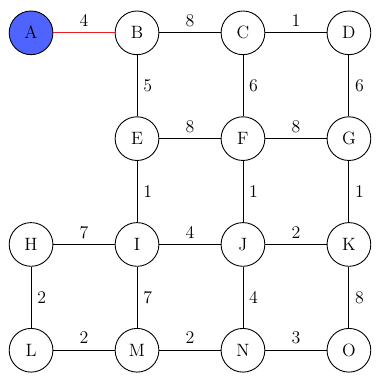
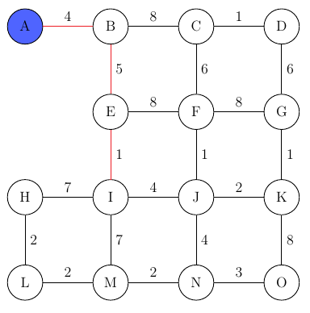
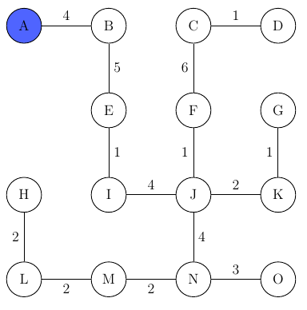

# Prim's Algorithm

Jarnik Prim's algorithm takes a weighted, normally undirected graph and produces the 
minimal spanning tree of that graph.

A minimal spanning tree of a graph contains the same nodes as the original graph, but
only a subset of the edges, those edges that keep the nodes connected, but have a
minimal weight.

For this the algorithm starts at a given node and then adds the neighboring
node with the smallest edge-weight to the graph:

Now the graph already consists of two nodes (A and B) and the process begins anew.
The next node to be added is E, as the edge weight 5 is the lowest possibility.

Now there are 3 possible connections (C, F, I) since the edge to node I has the
smallest cost, we add it to the graph...

This simple process continues until we have added all the nodes to our graph:

In the case of equal edge weights the algorithm proceeds lexicographically.
