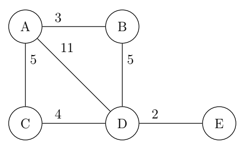

# Dijkstra's Algorithm for Shortest Paths
Named after Edsger W. Dijkstra, the 
Dijkstra algorithm is a fairly simple 
approach to solving the problem of 
finding the shortest path between nodes in 
a weighted graph.

To achieve this the algorithm manages a special
priority queue, in which the nodes and their 
respective distances are stored.

Consider the following example Graph:

Say you want to find the shortest path to every 
node starting from A. This is what the algorithm
would do step-by-step:
1. Add A to the queue with a distance of 0
2. Remove the first node from the queue
3. Insert the neighbors of the removed node into the priority queue
while adding up their distances with the distance of the first node
4. Repeat 2 & 3 until you reached the desired node or every node has been visited

A lot of this iteration of the algorithm depends on the implementation 
of the priority queue, however:

insertIntoQueue(...):
- If the node is not already in the queue and never was in the queue
(i.e. has not been visited) insert at priority and then lexicographically
- If the node is in the queue but with a lower priority (higher distance),
update the distance and sort by priority and then lexicographically

So in the above example this is what the queue and its updates would look like:

| Priority Queue  | Additions/Updates  |
|----|----|
| `(B,3), (C,5)` | `(B,3), (C,5)` |
| `(C,5), (D,8) (E,10)` | `(D,8), (E,10)` |
| `(D,8) (E,10)` | `-` |
| `(E,10)` | `-` |

This tells us the shortest path to every node from node A:

`(B,3),(C,5),(D,8),(E,10)`

By working backwards with these shortest distances and the weights
specified in the Graph, we get the shortest path from A to E:

A -> B -> D -> E
