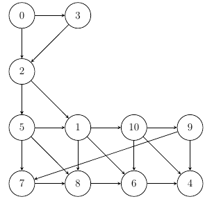

# Breadth-First Search

One of the simplest ways to traverse a graph is with the Breath-Frist search algorithm.

Where this algorithm explore the graph layer by layer starting from 
a node s, where s forms the layer 0.
The direct neighbors reachable from layer 0 form layer 1 and so on...

Generally, the nodes that are neighbors of a node in layer `i`, but not neighbors
of the nodes in layers `0,...,i-1` form layer i+1.

If layer s contains nodes 7, 5 the algorithm will first add the neighbors of
node 5 in ascending order to the visitation queue, then the neighbors of 7 
again, in ascending order.

Starting BFS from node 0:

- layer 0: 0
- layer 1: 2, 3
- layer 2: 1, 5
- layer 3: 6, 8, 10, 7
- layer 4: 4, 9

=> Final visitation order: 0, 2, 3, 1, 5, 6, 8, 10, 7, 4, 9
