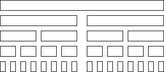

# QuickSort
QuickSort is an efficient but instable sorting algorithm that uses the divide and conquer principle.
QuickSort depends on a pivot element that influences the efficiency greatly:

## The algorithm
1. Choose pivot element // e.g. first, middle or random element
2. Split array into smaller arrays depending on Pivotelement
3. recursively sort sub-array with smaller keys
3. recursively sort sub-array with bigger keys

## Pivot element
There are multiple strategies one can use when choosing the pivot element:

- Last element (like in the implementation here)
- Random element: increases probability of better runtime
- Median: use selection algorithm to find middle element

Here are the impacts bad pivot selection can have:

Best case (pivot is always the median element):

Worst case (here pivot is always the smallest element):

## Complexity

| Best | Average | Worst | Stability |
|----|----|----|----|
| `Ω(n log(n))` | `Θ(n log(n))` | `O(n^2)` | no |
