# Binomial Heaps
Binomial heaps, like binary heaps, are a priority queue data
structure, storing values based on their relative priority.

An example of a binomial heap:

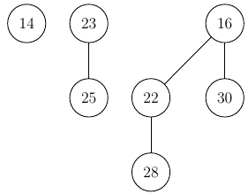

As you can see the heap is made up of multiple **Binomial Trees**,
which have their own invariants, the main being that the minimal key
hof a (sub-) tree are always at the root.

The other being the unusual shape, with every tree having a depth that
determines the number of children, where a tree of height `k` has
`2ᵏ` children. Thus we can tell that the trees above have the heights
0, 1 and 2 respectively.

## Merging Trees
If you merge two trees (always of the same height) it results in a new tree
with `heightNew = heightOld + 1`.

When merging trees you have to be careful to respect the invariant
of the minimal key. Since both trees have their minimal elements as the root, 
you simply use the smaller of the two as the new root node:

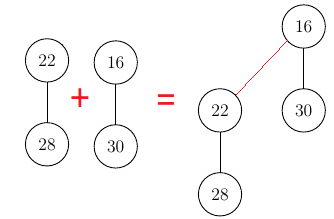

Here we merged two trees with height 1, which resulted in a new tree of
height 2. The invariant of the minimal element as the root has been honored
as we simply concatenated the bigger root to the smaller root.

This process is exactly the same regardless of the height of the trees:

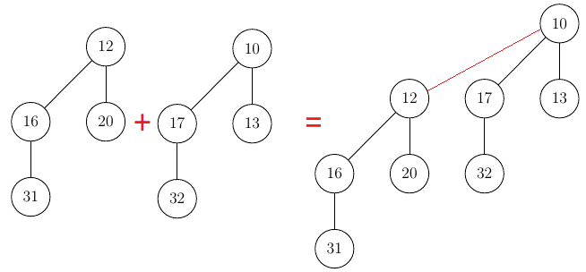

In a valid binomial heap there can **never** two trees with the same height.
They always have to be merged.

## Insertion
You might wonder why we touched on merging trees before we talked about
the basics of insertion, more often than not, results in merging.

The action of purely inserting a value into a tree could not be simpler.
You just have to add the new node as a tree with height 0 to the heap.
Consider this heap:

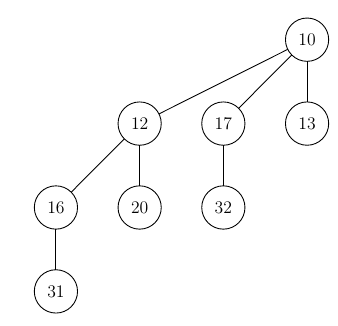

After inserting a value (say 8) we get our new heap:

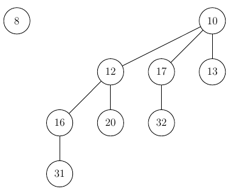

If the inserted value has a higher priority than our min node, the pointer
(see [deletion](https://ossner.github.io/TUMGAD/src/DataStructures/PriorityQueues/BinomialHeaps/BinomialHeaps#removing-the-highest-priority-node))

This is by far the simplest insertion there can be. However, it is not always
the case (obviously) because if there is another tree in the heap with height
0 we would have to merge the two to create a tree with height 1, and if there
is also a tree with height 1 already we would have to merge, etc.

At no point can there be two trees with the same height in a heap (As stated above)

Another (more complicated) insertion: Insert 14 into this heap

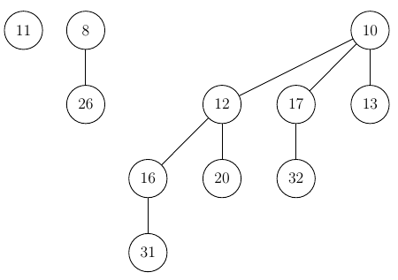

- Insert tree with height 0 and key 14 into the heap:

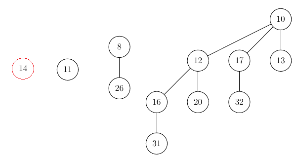

- Merging with other trees of the same height (0):

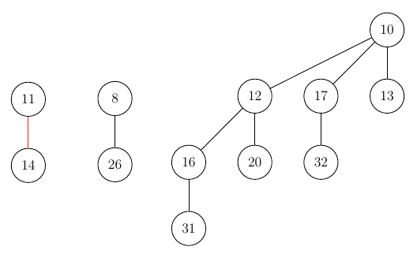

- Merging with other trees of the same height (1):

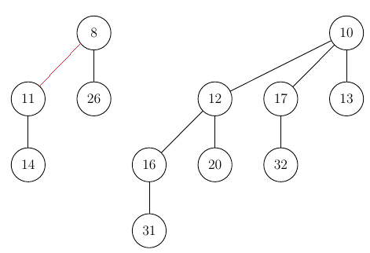

After this, we successfully inserted our value and there is nothing left to do.

## Removing the highest priority node

A key invariant of the binomial heap we have not yet covered is
the fact that the data structure always provides a pointer to the
node with the highest priority (pointer being a cyan node in this case):

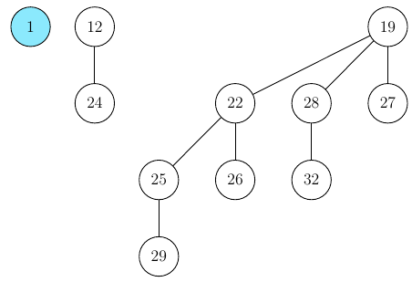

In this particular case the deletion is very simple again, all we have to
do is remove the minimal node and update the pointer.

This simplicity stems from the case that the tree with the min node
has the height 0, if this weren't the case, the tree would "splinter"
into a number of sub-trees (Trees of height `n` splinter into `n` children)

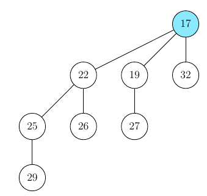

Deleting the min-node out of this tree will result
in 3 new trees, the min-node now being 19.

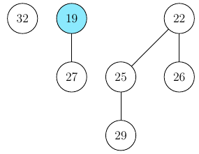

Remember that if there were trees with the same height
in the heap, we would have had to merge them.

## Time Complexity:

| Insertion  | Deletion  | Merge |
|----|----|----|
| `O(1)` | `O(log n)` | `O(log n)` |
