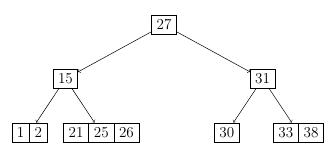
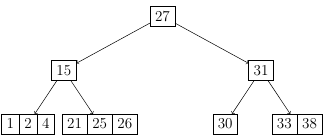
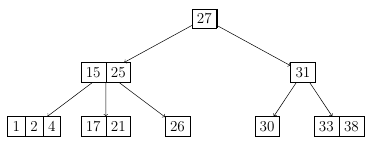
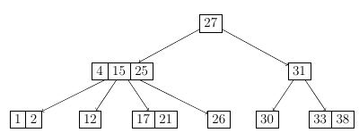
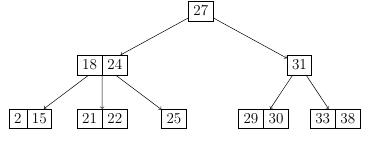
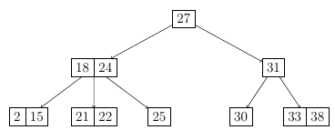
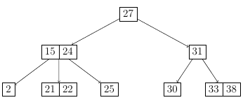

# (a,b) Trees
(a,b) Trees are self-balancing search structures that allow
for nodes with more than one value and child.

Each internal node except the root has at least `a`
and at most `b` children where `2 ≤ a ≤ (b+1)/2` and 
The root has at most b children.

An Example of a (2,4) tree:

## Insertion
Start by adding into the proper leaf node. If the addition causes
an overflow (b items), then split and propagate the middle item.

Example: Insert 4 into the tree above: In this case the insertion 
is fairly easy, as after we insert the number into the proper leaf, 
we do not break any invariant:

Now if we add, for example 17, we **do** break the invariant for the 
maximium size of a node. Because of this one of the middle nodes,
in this case 25 gets "pushed" into the parent node. And
since that now has 2 values, needs 3 children, so the leaf get
split into 2 (bigger and smaller than 25):

Here is another example with the same process (insert 12):

## Deletion
After deletion the invariants obviously have to be honored as well.
Consider the following example:

Deleting 29 out of the tree does not hurt any invariant, so we 
just remove it and we're done.

Now however, if we want to remove 18 it's slightly different,
as 18 is not a leaf, so we have to first switch it
with its predecessor (15) and then remove it from the leaf.

It's possible that an overflow or an underflow appears, and in that
case nodes need to be merges to keep the invariant.

## Time Complexity:

| Access | Search | Insertion | Deletion |
|----|----|----|----|
| `O(log n)` | `O(log n)` | `O(log n)` | `O(log n)` |

