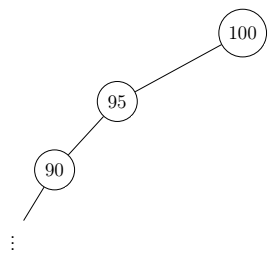
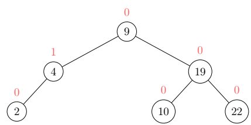
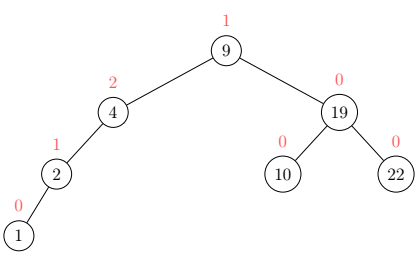
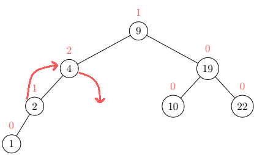
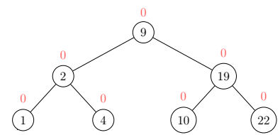

# AVL Trees
AVL Trees (names after Georgy **A**delson-**V**elsky and Evgenii **L**andis)
are balanced binary search trees. They solve the problem of binary search trees mutating into lists:

To achieve this, the trees manage so-called balances of their sub-trees
which are calculated by subtracting the right sub-tree height from the left.

An example AVL Tree with every node's balance in red:

If the balance of any node reaches a threshold of 2, rebalancing 
in the form of rotation is in order. The kind of rotation needed is 
determined by the balances:

| Parent balance  | Child Balance  | Rotation |
|----|----|----|
| 2 | 1 |right|
| -2 | -1 |left|
| 2 | -1 |left-right|
| -2 | 1 |right-left|

## Insert
Insertion into an AVL tree works just like in a BS Tree, just
remember to keep track of the balances. 

Example: Insert 1 into the above tree:

As you can see the node with value 4 has a balance
of 2 and its child node a balance of 1, thus a right-rotation 
is needed to satisfy the tree conditions:

## Deletion
Deleting a node from an AVL Tree is sometimes slightly more complicated.
If the node is a leaf, you simply remove it, update balances and
re-balance if necessary.

If the node is not a leaf, you switch it with its in-order predecessor
(i.e. the maximum node in the left subtree),
remove the node you want to remove (as it is now a leaf), update balances and re-balance if necessary.

## Time Complexity:

| Access | Search | Insertion | Deletion |
|----|----|----|----|
| `O(log n)` | `O(log n)` | `O(log n)` | `O(log n)` |
